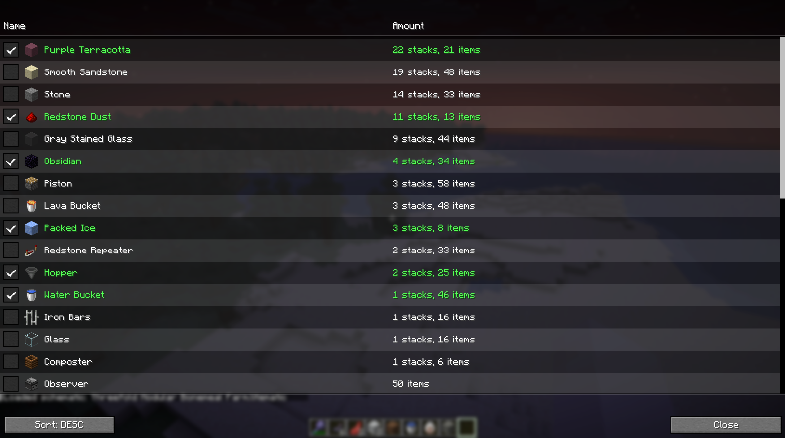

# Better Litematica Materials List

A lightweight, quality-of-life Fabric mod designed for Litematica users. It provides an interactive, persistent checklist dashboard of all the materials required for your schematic.

---

## Features

* **Persistent Progress Saves:** Checkboxes save instantly to your hard drive on a background thread. Your checked-off items persist even if you force-close or restart Minecraft.
* **Per-Schematic Tracking:** Progress files are unique to each individual `.litematic` file. Switching schematics automatically loads your exact checklist progress for that specific build.

---

## How To Use

1. **Load a Schematic:** Press the configured hotkey (Default: `Z`, rebindable in standard Controls settings) to select a schematic.
2. **Open the Dashboard:** Press the configured hotkey (Default: `X`, rebindable in standard Controls settings) to view the materials list
3. **Manage Progress:** Click the checkboxes on the left as you gather or place your building blocks to check items off the list.
4. **Change Sorting:** Use the `Sort` button in the bottom corner to dynamically switch how your material list is prioritized.

---

## License

This project is available under the **GNU GPLv3 License**. Feel free to include it in modpacks!